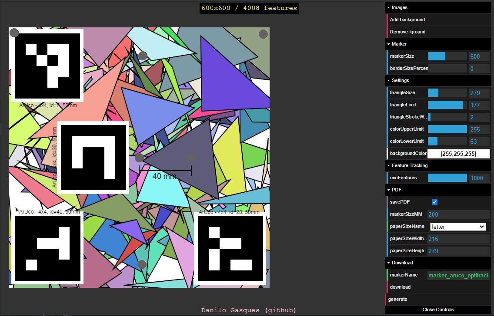

# [AR Marker Generator](https://danilogr.github.io/AR-Marker-Generator/)
> In a hurry? Download our [sample marker (20cm)](https://danilogr.github.io/AR-Marker-Generator/sample%20marker/) as [PDF](https://danilogr.github.io/AR-Marker-Generator/sample%20marker/marker_aruco_optitrack_vuforia.pdf), [Unity Package](https://danilogr.github.io/AR-Marker-Generator/sample%20marker/VuforiaOptiTrackArUcoMarker.unitypackage), [jpeg](https://danilogr.github.io/AR-Marker-Generator/sample%20marker/marker_aruco_optitrack_vuforia.jpeg), or [.patt](https://danilogr.github.io/AR-Marker-Generator/sample%20marker/marker_aruco_optitrack_vuforia.patt)!

Augmented Reality Marker generator for libraries such as [Vuforia](https://www.vuforia.com/), [ARToolkit](https://github.com/artoolkit), and [AR.js](https://github.com/jeromeetienne/AR.js).

This tool
 * Runs on the browser (Tested on Chrome 67+). [Try it](https://danilogr.github.io/AR-Marker-Generator/)
 * Creates a random, high-fidelity tracking marker for several tracking technologie (Vuforia, ARToolkit, AR.js, ...)
 * Supports selecting custom foreground image and background image - **yes, you can use this tool to create a pdf for your existing markers!**
 * Guarantees 5-start trackers on Vuforia. It uses [tracking.js](https://trackingjs.com/) to generate highly trackable markers
 * Produces a PDF with custom marker dimensions (defaults to 8x8 cm) to make printing fast and easy
 * Generates .patt file for ARToolKit and AR.js
 
## [Click here to try](https://danilogr.github.io/AR-Marker-Generator/)

## Future work

I wish that there was a way of telling how the marker's quality degrade over time. I also wish that there was a way of generating a set of markers that are not similar to each other.

If I ever have time, I would 

- [ ] Use [three.js](https://threejs.org/) to render a marker at different distances and angles
- [ ] Use [AR.js](https://github.com/jeromeetienne/AR.js) to assess detection confidence at these different distances and angles
- [ ] Use [tracking.js](https://trackingjs.com/) to see how the number of detected features change over angles and distance

# License
 This work is licensed under a <a rel="license" href="http://creativecommons.org/licenses/by-nc-sa/4.0/">Creative Commons Attribution-NonCommercial-ShareAlike 4.0 International License</a>.
<small>If you are insterested in making a commercial use of this code, please, reach out to the authors</small>
