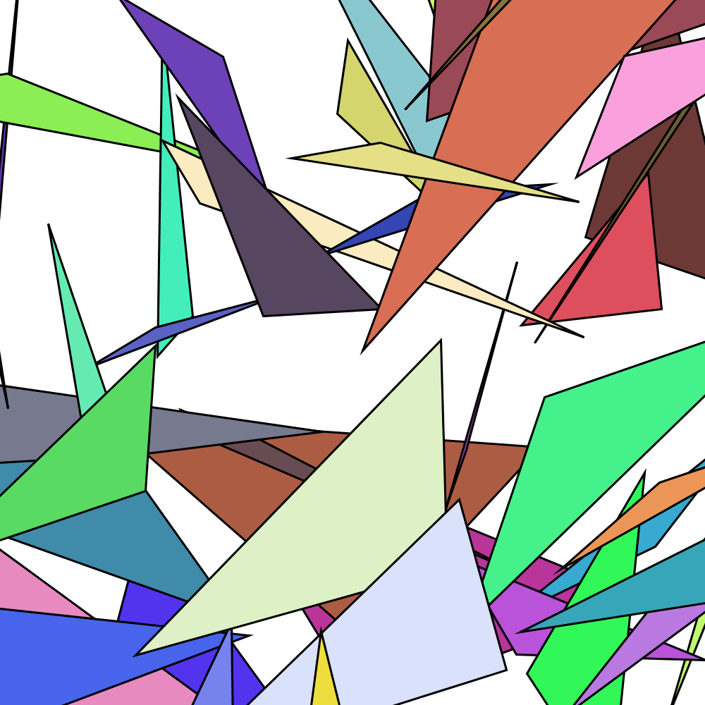
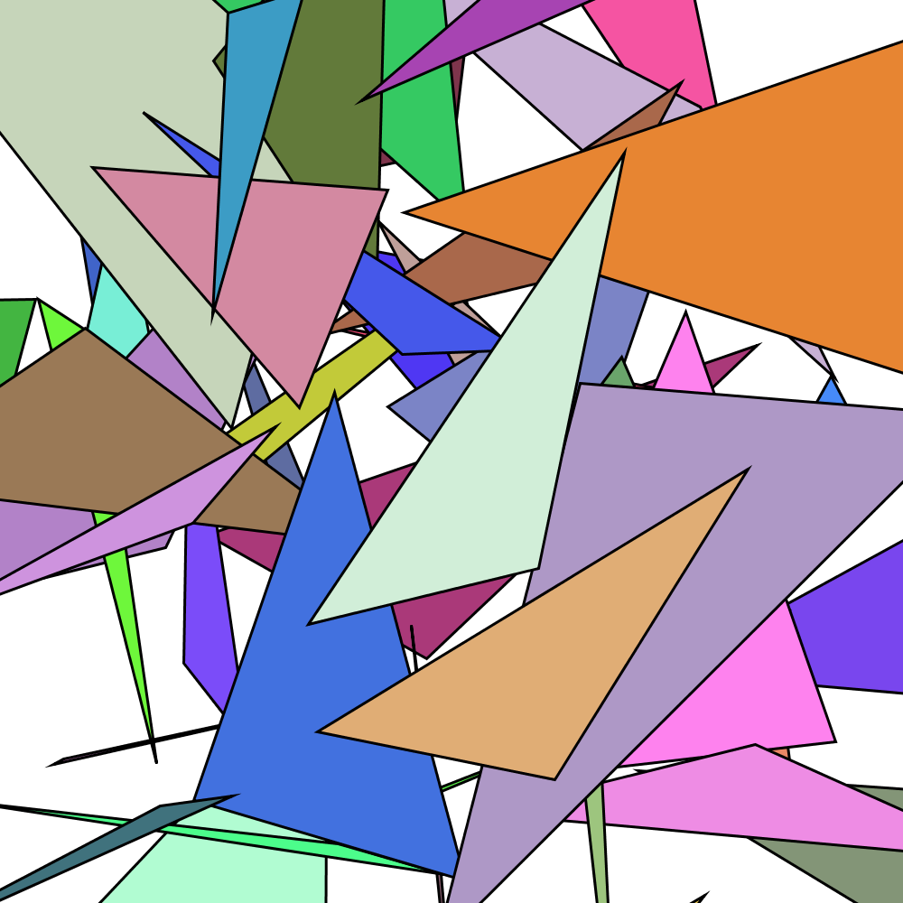

# AR-Marker-Generator

A processing sketch that generates markers for Augmented Reality applications like [Vuforia](https://www.vuforia.com/).
This allows you to create single markers but also named sets of markers (batch processing). 

## How to use

### Using directly in the Processing IDE

1. Edit the file ``marker_names.txt`` to add your own market names.
2. Edit the file and add each marker name; separating each word with a comma (``,``).
3. Open the ``armarkergenerator.pde`` sketch in your processing IDE.
4. Click ``play`` to start generating your AR markers. These will show up in your ``markers``directory. (Note that you can change this directory by changing the variable ``String directory = "markers";``)

### Using the binary executables (releases)

1. Edit the file ``marker_names.txt`` to add your own market names. **Note: when you are using the executable in Mac**, this text file is bundled inside the executable.app, which you can view when you open the .app as a folder, e.g., ``armarkergenerator.app/Contents/Java/data/``) 2. Edit the file and add each marker name; separating each word with a comma (``,``).
3. Download the release [from our github](https://github.com/PedroLopes/AR-Marker-Generator/releases) (depends on your operating system and comes bundled with java already)
4. Double click to execute it.
5. It will start generating your AR markers; then wait for it to close automatically (likely takes 10 seconds). The markers will show up in your ``markers``directory.

/Users/pedro/Documents/Processing/AR-Marker-Generator/armarkergenerator/application.macosx/

## Examples of generated markers

* color and low density of triangles (tested in Vuforia and HoloLens with good results)

* color and low density of triangles (tested in Vuforia and HoloLens with good results)

* black and white and high density of triangles (tested in Vuforia and HoloLens with good results)

## Testing

* This has been successfully tested using Processing 3.0b4 (alpha), which is revision 0242. If you tested on a newer version, feel free to let us know what happened using a issue tracker / pull request. 

* The markers have been used in a custom app built with [Vuforia](https://www.vuforia.com/) +  [Unity3D](https://unity3d.com/) inside the [HoloLens](https://www.microsoft.com/en-us/hololens). 

