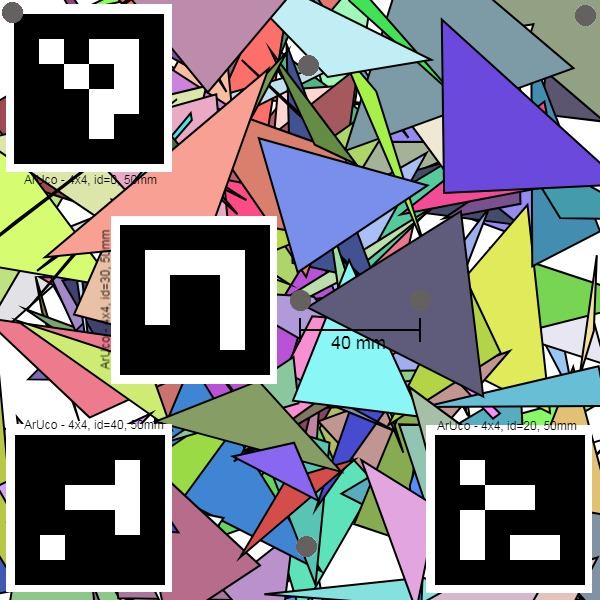
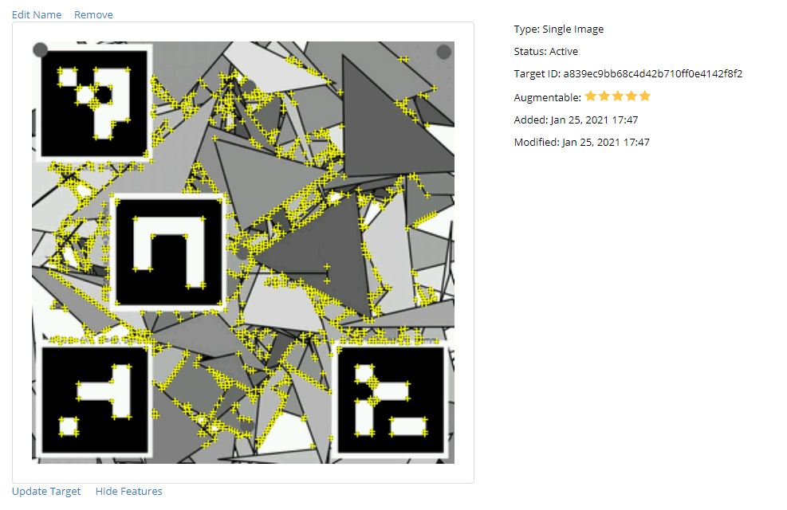

# Sample marker

This folder contains a sample marker that works well with Vuforia,
 ArUco, AR.js and can be tracked by a motion capture camera such as OptiTrack.

I created this marker using the latest version of the [AR-Marker-Generator](https://danilogr.github.io/AR-Marker-Generator/) that allows me
to chose a foreground image of my own. For this sample marker, I used an overlay with 6 gray circles and four ArUco markers (see [marker_overlay_600x600_200mm.png](marker_overlay_600x600_200mm.png)).
If you have a motion capture system that uses infrared tracking, you can attach reflective infrared markers to the gray circles.

 - [marker_aruco_optitrack_vuforia.jpeg](marker_aruco_optitrack_vuforia.jpeg) - Picture file that can be used on tools like Vuforia 
 - [marker_aruco_optitrack_vuforia.patt](marker_aruco_optitrack_vuforia.patt) - .patt file designed for ARToolkit / AR.js 
 - [marker_aruco_optitrack_vuforia.pdf](marker_aruco_optitrack_vuforia.pdf) - Pdf with the proper printing dimensions (letter page with a 20cm by 20 cm marker)
 - [VuforiaOptiTrackArUcoMarker.unitypackage](VuforiaOptiTrackArUcoMarker.unitypackage) - Unity package for tracking this marker with Vuforia

## Tracking with Vuforia

Vuforia developer console gave this marker 5 stars, so you should expect really good tracking results.

`TODO: show results`

## Tracking with ArUco (TODO)

## Tracking with ar.js (TODO)

## Tracking with OptiTrack (TODO)

